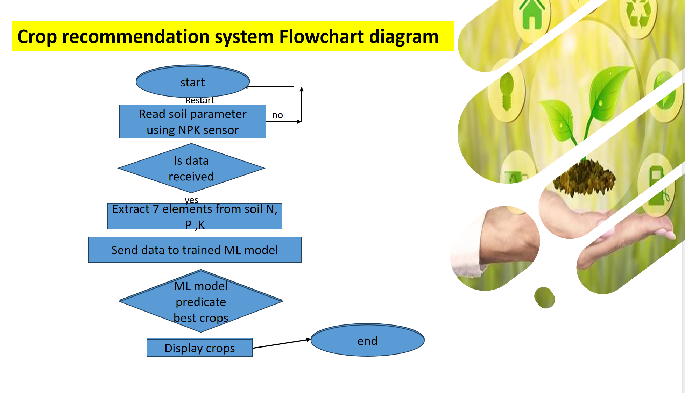
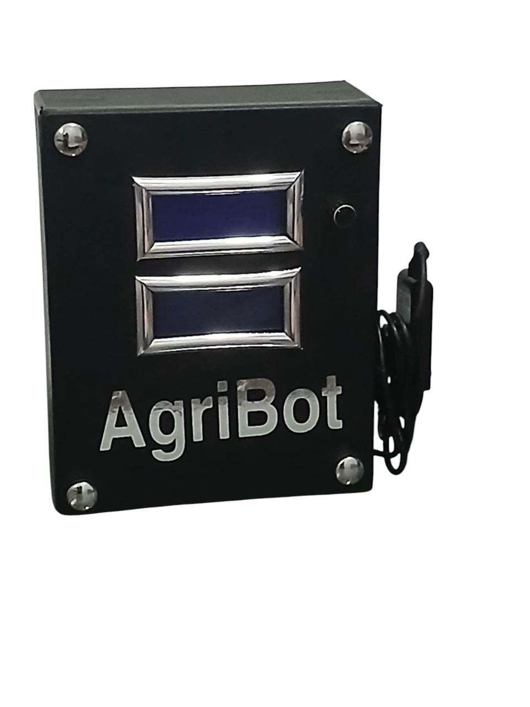
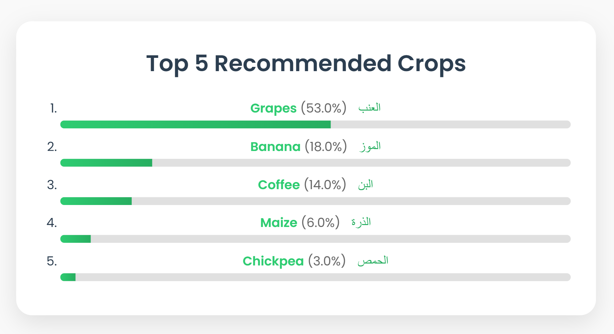

# GreenSense: Crop Recommendation System and Soil Analysis 🌱

<div align="center">



[](LICENSE)
[](https://www.python.org/downloads/)
[](https://fastapi.tiangolo.com/)

</div>

## 📌 Overview

GreenSense is an intelligent agriculture system that combines IoT technology with machine learning to provide accurate crop recommendations based on soil composition and environmental conditions. The system helps farmers make data-driven decisions to optimize crop yields and promote sustainable farming practices.

## ✨ Features

- **Real-time Soil Analysis**
  - NPK (Nitrogen, Phosphorus, Potassium) levels
  - pH measurement
  - Temperature monitoring
  - Humidity tracking

- **Smart Recommendations**
  - ML-powered crop suggestions
  - Probability scores for each recommendation
  - Support for multiple crop varieties
  - Bilingual support (English/Arabic)

- **User-Friendly Interface**
  - Responsive web application
  - Interactive data visualization
  - Real-time sensor readings
  - Mobile-friendly design

## 🛠️ Hardware Components

- Raspberry Pi 5 (Main Controller)
- NPK 7-in-5 Pin Soil Sensor
- Arduino Uno
- MAX RS485-TTL Interface Module
- 2x LCD Screens
- 12V Batteries (2x)


## 🚀 Installation

1. **Clone the repository**
```bash
git clone https://github.com/MoazEldsouky/Crop-Recommendation-System-and-Soil-Analysis.git
cd Crop-Recommendation-System-and-Soil-Analysis
```

2. **Install dependencies**
```bash
# Backend dependencies
pip install -r requirements.txt

# Frontend dependencies (if using npm)
cd web_app/frontend
npm install
```

3. **Set up the hardware**
- Connect the NPK sensor to Arduino via RS485
- Link Arduino to Raspberry Pi
- Configure LCD displays
- Set up power supply

4. **Start the application**
```bash
# Start backend server
cd web_app/backend
uvicorn main:app --reload

# Open frontend in browser
open web_app/frontend/index.html
```

## 🤖 AgriBot Device

Our hardware solution, AgriBot, is a standalone device that:
- Reads real-time NPK values from soil using specialized sensors
- Processes data through Raspberry Pi
- Uses trained ML model for instant crop recommendations
- Displays results on dual LCD screens:
  - Screen 1: Top recommended crops
  - Screen 2: Soil parameters and features
- Includes physical control buttons for easy interaction



## 📊 Model Performance

Our RandomForestClassifier model achieved excellent results:
- Accuracy: 97.28%
- Precision: 97.61%
- Recall: 97.27%
- F1 Score: 97.33%


*Web interface showing model output for top recommended crops*

## 👥 Team

- **Project Supervisor:** Dr. Zinab Hassan
- **Team Members:**
  - Moghazy Refaat (Developer Engineer)
  - Mohamed Omar (Web Developer)
  - Moaz El-Dsouky (Machine Learning Engineer)
  - Saied El-Rahmany (Electrical Engineer)
  - Ahmed Abo-Elkhair (Hardware Engineer)
  - Omar Eid (Software Engineer)
  - Omar Alaa (Hardware Engineer)
  - Fawzy Ibrahim (Hardware Engineer)
  - Ahmed Abo-bakr (Hardware Engineer)
  - Ramadan El-sayed (Hardware Engineer)

## 📄 License

This project is licensed under the MIT License - see the [LICENSE](LICENSE) file for details.

## 🤝 Contributing

Contributions are welcome! Please feel free to submit a Pull Request.

1. Fork the repository
2. Create your feature branch (`git checkout -b feature/AmazingFeature`)
3. Commit your changes (`git commit -m 'Add some AmazingFeature'`)
4. Push to the branch (`git push origin feature/AmazingFeature`)
5. Open a Pull Request at [https://github.com/MoazEldsouky/Crop-Recommendation-System-and-Soil-Analysis/pulls](https://github.com/MoazEldsouky/Crop-Recommendation-System-and-Soil-Analysis/pulls)

## 📞 Contact

- Email: info@greensense.com
- Project Link: [https://github.com/MoazEldsouky/Crop-Recommendation-System-and-Soil-Analysis](https://github.com/MoazEldsouky/Crop-Recommendation-System-and-Soil-Analysis)

---
<div align="center">
Made with ❤️ by GreenSense Team
</div>